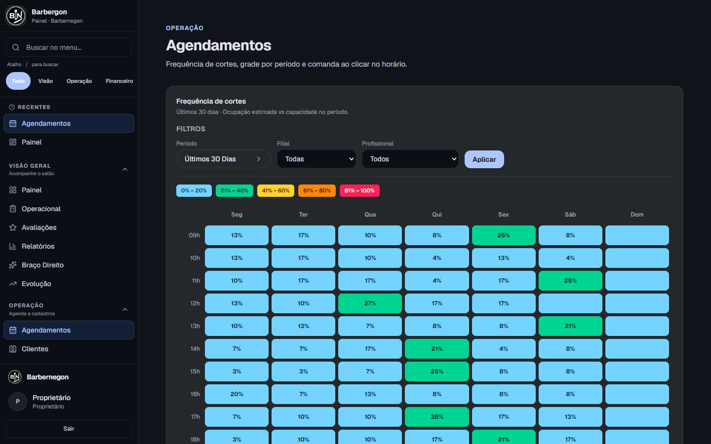
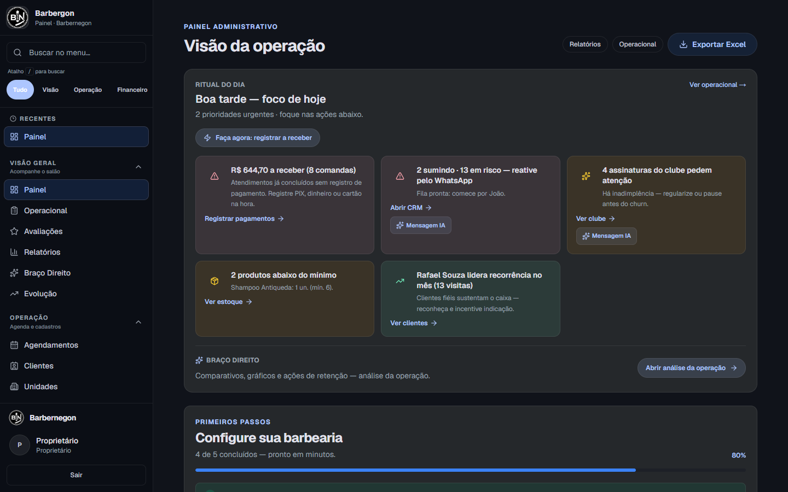
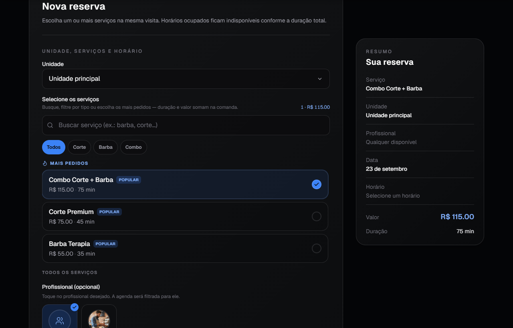
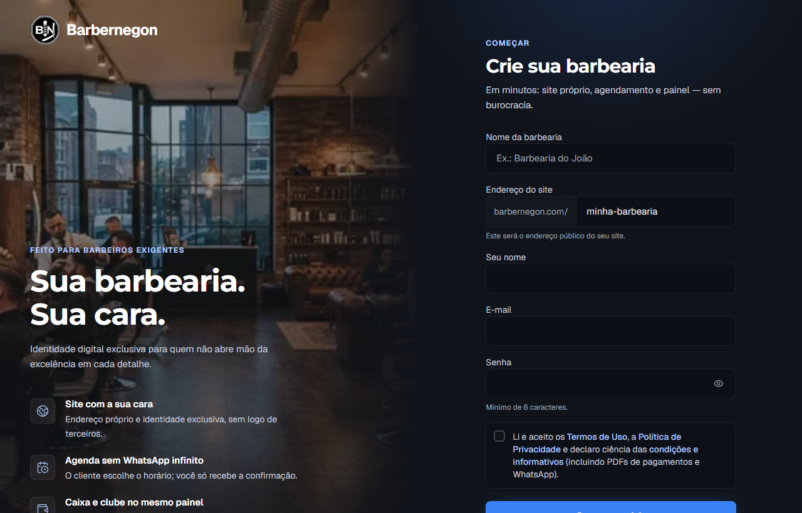
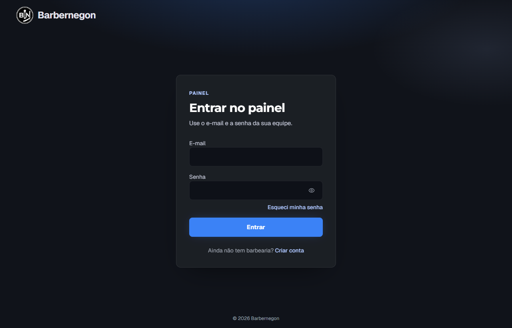

# Vaga Perdida

**Barbernegon** · Guia prático

A casa parece cheia no WhatsApp e a semana ainda fecha fraca. Aqui está o motivo — e o caminho mais curto para parar de perder dinheiro em horário vazio.

> **CONFIG — links de produção (Railway)**
>
> - Cadastro: `https://barbernegon-production.up.railway.app/cadastro`
> - Login: `https://barbernegon-production.up.railway.app/admin/login`
> - Piloto ao vivo: `https://barbernegon-production.up.railway.app/ze-do-corte`

---

## O que você recebe

- Diagnóstico rápido: descubra em minutos quanto você perdeu essa semana
- Os 5 motivos pelos quais a vaga some (e qual atacar primeiro)
- 3 mensagens prontas para confirmar, proteger e repor horário
- Checklist de 7 dias para aplicar tudo, passo a passo
- O caminho direto para fazer isso rodar sozinho, todo dia

*Sua barbearia. Sua cara. Sem burocracia.*

---

## 01 — Comece por aqui

### Para quem é este guia

Você sente a casa “andando” — mensagem o dia todo no WhatsApp — mas o caixa da semana não fecha do jeito que o movimento sugere. Esse buraco tem nome: **vaga perdida**. Horário que podia ter virado dinheiro e evaporou sem ninguém contar.

Este guia é curto de propósito. Primeiro você mede o problema em poucos minutos. Depois aplica 4 correções simples. No final, mostro como isso passa a acontecer sozinho.

### Teste expresso (2 minutos, olhando hoje)

Não precisa contar a semana inteira agora — só olhar o dia de hoje.

1. Quantos horários abertos hoje ainda não foram preenchidos?
2. Alguém cancelou hoje e a vaga ficou parada?
3. Multiplique isso pelo preço do seu serviço mais vendido.

**Esse número já dói?**

Multiplique por 6 dias de semana. É isso que este guia existe para reverter. Na seção 03 você refaz esse cálculo com mais precisão, usando uma semana fechada.

---

## 02 — O problema de verdade

### WhatsApp cheio não é o mesmo que casa cheia

Mensagem o dia inteiro parece demanda. Na prática, muita coisa ali é gente perguntando “tem horário?”, remarcando em cima da hora, ou só olhando preço. Enquanto você digita resposta, a cadeira do lado esfria — e o chat não te mostra isso.

**Vaga perdida** = horário que podia virar atendimento pago e não virou. Não é só falta — é cancelamento sem reposição, é horário “guardado” ontem que hoje ficou vazio, é vaga que nunca foi oferecida com clareza porque a resposta demorou.

### Por que a falta custa em dobro

Quando você reserva um horário, já recusou outra pessoa que perguntou antes. Se quem reservou falta e não tinha ninguém pronto pra entrar no lugar, você perde as duas vendas — não só uma.

### Para quem este guia serve

- 1 unidade, poucos barbeiros, agenda ainda misturada no WhatsApp
- Casa “andando”, mas o caixa da semana não fecha como o movimento sugere
- Já tentou organizar, e em poucos dias voltou ao improviso

---

## 03 — Meça direito

### Diagnóstico completo (uma semana já fechada)

Opcional, mas mais preciso. Pegue uma semana que já passou. Conte só o que de fato aconteceu — sem achismo.

| Campo | O que contar | Sua semana |
|-------|--------------|------------|
| Horários abertos | Slots vendáveis do expediente (tire almoço, folga, bloqueio) | ______ |
| Horários atendidos | Só quem sentou e concluiu de verdade | ______ |
| Ticket âncora | Preço do serviço que mais vende (não a média sonhada) | R$ ______ |

### Conta

**Vagas perdidas** = abertos − atendidos.

**Dinheiro na mesa** = vagas perdidas × ticket âncora.

Exemplo: 48 abertos, 37 atendidos, ticket R$ 70 → **11 vagas → R$ 770 na semana**. Em 4 semanas, quase um aluguel — sem nenhum alarme tocar no seu caixa.

### Enquanto o número ainda está fresco

Esse cálculo, o Barbernegon faz sozinho — todo dia, sem você preencher tabela nenhuma. Se quiser ver isso rodando com os números da sua própria barbearia, o cadastro é gratuito e leva menos tempo do que você levou pra preencher essa tabela.

**[Ver meu número automático →](https://barbernegon-production.up.railway.app/cadastro)**

*Sem compromisso — o restante do guia continua valendo mesmo se você seguir só no papel por enquanto.*

---

## 04 — Por que a vaga some

Os 5 motivos, em português simples.

### 1. Você acha que combinou, o cliente acha que talvez

No chat, o “ok, marcado” vira reserva firme pra você e “vou tentar ir” pra ele. Sem prazo claro, a falta é previsível — não é má vontade do cliente, é o combinado que ficou frouxo.

*Nota: o termo técnico é “assimetria de compromisso”.*

### 2. Você demora pra repor e a vaga esfria

Cancelou de manhã sem ninguém de prontidão pra entrar? Depois de umas 2 horas, a chance de preencher despenca. O problema não é o cancelamento em si — é a demora pra avisar quem topa entrar na hora.

*Nota: a “janela de reposição” é a primeira hora depois do cancelamento.*

### 3. Só você sabe o que está livre

Enquanto você responde um por um no WhatsApp, quem perguntou já marcou no salão ao lado. A demanda não sumiu — foi pra quem respondeu mais rápido e mais claro.

*Nota: inventário invisível.*

### 4. Você paga pra alugar cliente de outro app

Marketplace traz visita, não hábito. O cliente compara seu preço com o da barbearia ao lado, na mesma tela. E o histórico de quem marcou fica com o app — não com você.

*Nota: demanda alugada.*

### 5. Marcar no chat não parece compromisso de verdade

Uma reserva que vive só numa mensagem de WhatsApp é fácil de esquecer ou remarcar sem culpa. Uma reserva que vive numa página com a cara da sua marca pesa mais na cabeça do cliente.

*Nota: âncora de compromisso fraca.*

### Se só puder mudar uma coisa

Nessa ordem:

1. Prazo claro na confirmação
2. Uma lista pronta de 10 pessoas flexíveis pra encaixe
3. Um link único pra marcar (em vez de digitar horário no chat)

A confirmação sozinha já reduz falta; sem lista, o cancelamento ainda vira buraco.

---

## 05 — Correção prática

### 4 ajustes que seguram a cadeira

**A. Mostre só o horário que existe de verdade**

Publique o expediente real, não o ideal no papel. Separe serviço longo de curto pra não sobrar buraco impossível de encaixar. Deixe 1–2 janelas por dia livres só pra encaixe.

**B. Confirme com prazo — não com “ok, te espero”**

Toda marcação precisa de um prazo pra confirmar e um lembrete na véspera. Sem resposta até o prazo, a vaga libera pra fila.

**C. Tenha uma lista pronta pra encaixe**

10 a 20 nomes de clientes flexíveis, separados por manhã/tarde. Cancelou? Dispara em ordem, um a um.

**D. Separe “marcar” de “conversar”**

WhatsApp continua sendo o canal de relacionamento — pra tirar dúvida, mandar foto, combinar. Mas a marcação em si funciona melhor fora do chat, num link único que mostra o horário certo, sem ida e volta.

### 3 scripts prontos (copie e cole)

**Confirmação com prazo**

> Fala, [Nome]! Seu horário: [dia] às [hora] — [serviço]. Responde 1 pra confirmar ou 2 pra remarcar até [prazo]. Sem resposta, libero a vaga.

**Lembrete na véspera**

> [Nome], amanhã às [hora] te esperamos. Não vai poder? Avisa até [limite] — tenho fila de encaixe.

**Encaixe rápido**

> Abriu horário hoje às [hora] pra [serviço]. Quer encaixar? Responde AGORA.

### Política simples contra falta

2 faltas seguidas sem avisar → próximo horário só em horário menos concorrido, ou com sinal.

Avise a regra já na primeira marcação — regra inventada depois da briga não funciona.

### Erros que anulam o método

- Continuar marcando só no chat sem prazo
- Regra complexa demais que você mesmo abandona em 2 dias
- Achar que “ter um app” resolve sem aplicar nenhuma das regras acima

---

## 06 — Checklist — 7 dias

| Dia | Ação |
|-----|------|
| 1 | Calcule sua vaga perdida da semana passada (seção 03) e o R$ que ficou na mesa |
| 2 | Ajuste o expediente publicado pro que você realmente cumpre |
| 3 | Salve os 3 scripts prontos no seu celular |
| 4 | Monte sua lista de 10 clientes flexíveis pra encaixe |
| 5 | Avise sua política de falta pros próximos agendamentos |
| 6 | Tire a marcação do meio da conversa solta — use um link único |
| 7 | Meça de novo e compare com o Dia 1 |

---

## 07 — A virada

### O método funciona. O gargalo é você ter que lembrar de tudo

Confirmar, remarcar, disparar lista, lembrar prazo, saber quem tá livre — isso é gestão. E quem está com a máquina na mão vive outra fila: atraso, cliente sem hora marcada, barbeiro faltando.

Padrão comum: o método dura 3 ou 4 dias. Depois volta o improviso — e a vaga perdida volta também, só que sem alarme nenhum tocando.

### A pergunta que muda o jogo

E se a confirmação, o lembrete, a fila de encaixe e a agenda vivessem num sistema — enquanto você corta o cabelo, sem depender da sua memória no meio do rush?

---

## 08 — Onde cada correção mora no sistema

### O que muda quando isso é automático

Você acabou de aplicar cada correção na mão. Veja onde ela vive sozinha dentro do painel do Barbernegon.

**Grade de ocupação** — resolve o motivo 3 (só você sabia o que estava livre): você vê onde a ocupação cai, sem contar nada na mão.

**Painel administrativo** — resolve o motivo 2 (vaga esfria): mostra o que precisa de ação agora, não um feed de WhatsApp pra garimpar.

**Importante:** o sistema não inventa sua lista de encaixe nem escreve o texto da véspera por você. As seções 05 e 06 deste guia continuam sendo a regra — o sistema é onde a regra para de depender só da sua memória.

**Fluxo de agendar** — resolve o motivo 1 (combinado frouxo): a reserva vira uma tela com resumo, não um “ok” solto no meio da conversa.

**Site com a marca da barbearia** — resolve os motivos 4 e 5 (app de terceiro + marca fraca): link próprio, sem concorrente do lado, sem depender de app de terceiro.

---

## 09 — Caminho de acesso

### O que você vê ao criar sua conta

Sem mistério: você cria a barbearia, configura serviços e expediente, e já sai com site e agenda no ar.

**Cadastro** — cria sua barbearia e já define o endereço do seu site próprio.

**Login do painel** — depois do cadastro, é por aqui que você volta todo dia.

---

## 10 — Próximo passo

### Tire a agenda do improviso

Você já sabe onde a vaga some e já tem os scripts pra corrigir na mão. Agora é decidir se quer continuar repetindo isso todo dia — ou deixar o sistema fazer por você.

**Comece grátis no Barbernegon**

Cadastro leva poucos minutos. Sem cartão. Os números que você calculou neste guia podem ser conferidos direto no seu painel assim que você entrar.

**[Criar minha barbearia agora →](https://barbernegon-production.up.railway.app/cadastro)**

Já tem cadastro? [Entrar no painel →](https://barbernegon-production.up.railway.app/admin/login) · Quer ver funcionando antes? [Ver piloto ao vivo →](https://barbernegon-production.up.railway.app/ze-do-corte)

---

*Sua barbearia, sua cara, sem burocracia.*

© Barbernegon — material educativo. Adapte as regras à sua operação.
