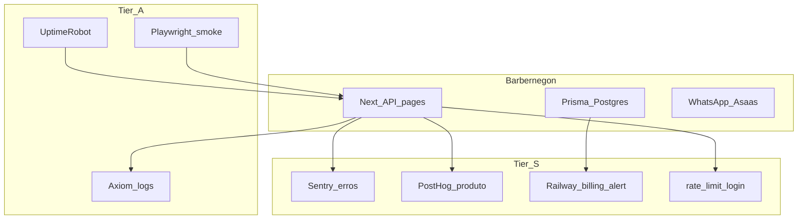

# Observabilidade e ferramentas SaaS (Barbernegon)

Como a **tier list** de ferramentas se encaixa neste projeto (Next.js 16 + Prisma + Railway).

| Tier | Objetivo |
|------|----------|
| **S** | Ligar já (ou já está) — pouca fricção, alto valor |
| **A** | Esta semana — estabilidade e regressão |
| **B** | Quando a base/uso crescer |

---

## Tier S — hoje

### 1. Rastreador de erro (Sentry) — **no código**

| Item | Detalhe |
|------|---------|
| Onde | Erros de API (`/api/*`), SSR, `global-error`, proxy/edge; gancho `captureException` em [`src/lib/observability.ts`](../src/lib/observability.ts) |
| Pacote | `@sentry/nextjs` |
| Arquivos | `src/instrumentation.ts`, `src/instrumentation-client.ts`, `src/sentry.server.config.ts`, `src/sentry.edge.config.ts`, `src/app/global-error.tsx`; `withSentryConfig` em `next.config.ts` |
| Env | `SENTRY_DSN` + `NEXT_PUBLIC_SENTRY_DSN` (mesmo valor do painel); `SENTRY_ENVIRONMENT` (`development` local / `production` na Railway); sourcemaps: `SENTRY_AUTH_TOKEN` + opcional `SENTRY_ORG` / `SENTRY_PROJECT` |
| Org/projeto | Defaults em `withSentryConfig`: org `barbergon`, project `bargergon` (slug do painel Sentry; override via env) |
| Ativar | Colar DSN em `.env.local` (dev) e na Railway (prod) → redeploy. Sem DSN o SDK fica `enabled: false` |
| Status | SDK + env alinhados; eventos só com DSN definido |

### 2. Analytics de comportamento (PostHog) — **scaffold no código**

| Item | Detalhe |
|------|---------|
| Onde | Landing, cadastro, agendar, funil Free→Pro, uso do canvas |
| Env | `NEXT_PUBLIC_POSTHOG_KEY`, `NEXT_PUBLIC_POSTHOG_HOST` (default `http s://us.i.posthog.com`) |
| Código | [`src/components/analytics-provider.tsx`](../src/components/analytics-provider.tsx) — só inicia se a key existir |
| Eventos sugeridos | `signup_completed`, `booking_created`, `plan_upgrade_clicked`, `site_published` |

### 3. Alerta de custo na cloud (Railway) — **painel, sem código**

| Item | Detalhe |
|------|---------|
| Onde | Projeto Railway → Usage / Billing → alerts de uso |
| Ação | Definir alerta de gasto mensal (ex. 80% do teto) + alertas de Postgres storage |
| Relacionado | Pool Prisma já limitado (`max` ~5) para não explodir conexões |

### 4. Rate limit no login — **já existe**

| Item | Detalhe |
|------|---------|
| Código | [`src/lib/rate-limit.ts`](../src/lib/rate-limit.ts) |
| Rotas | Login admin, Ops login, cadastro, forgot/reset password, leads, agendamento público |
| Limite | In-memory por processo (best-effort na Railway; suficiente contra brute force óbvio) |
| Melhoria futura (B) | Redis/Upstash se houver várias réplicas |

---

## Tier A — esta semana

### 5. Monitor de uptime (UptimeRobot / Better Stack)

| Item | Detalhe |
|------|---------|
| Checks | `GET https://SEU_DOMINIO/` (200) + `GET /admin/login` + opcional `/api/...` health |
| Health leve | Criar depois `GET /api/health` (DB ping) — recomendado |
| Alerta | E-mail / Telegram / WhatsApp do Ops |

### 6. Log central estruturado (Axiom / Better Stack Logs / Railway logs)

| Item | Detalhe |
|------|---------|
| Hoje | `console.error` + logs Railway |
| Alvo | JSON `{ level, msg, orgId?, route, requestId }` → Axiom ou Loki |
| Encaixe | Wrapper em [`src/lib/observability.ts`](../src/lib/observability.ts) (`logInfo` / `logError` / `captureException`) |

### 7. Teste do fluxo crítico (Playwright)

| Item | Detalhe |
|------|---------|
| Smoke mínimo | Cadastro (ou login demo) → `/{slug}/agendar` → confirmar → `/minha-reserva/[token]` → login admin |
| Onde | `e2e/` + `npm run test:e2e` (a adicionar) |
| CI | GitHub Action no push em `main` (opcional) |
| k6 | Só se precisar carga em `available` / login |

---

## Tier B — quando crescer

### 8. Dashboard o11y (Grafana / Railway metrics)

Métricas de latência p95 das APIs, taxa 5xx, conexões Postgres. Só vale com tráfego real e logs/métricas centralizados.

### 9. Feature flags

| Opção | Uso |
|-------|-----|
| PostHog flags | Ligado ao analytics já previsto |
| Flags em `Organization` / env | Ex.: `WHATSAPP_REMINDERS_ENABLED`, canvas beta |
| Evitar | Flags espalhadas sem dono |

### 10. Scan de dependência (Dependabot)

| Item | Detalhe |
|------|---------|
| Arquivo | [`.github/dependabot.yml`](../.github/dependabot.yml) |
| Escopo | `npm` semanal + GitHub Actions |

---

## Mapa rápido vs produto Barbernegon

---

## Checklist de ativação (ordem sugerida)

1. Confirmar rate limit em produção (já no código).
2. Criar projeto PostHog → colar `NEXT_PUBLIC_POSTHOG_KEY` na Railway → redeploy.
3. Sentry: DSN em `.env.local` (dev) e na Railway (`SENTRY_ENVIRONMENT=production`) — org `barbergon` / project `bargergon`.
4. UptimeRobot nos 2–3 URLs críticos.
5. Alerta de billing na Railway.
6. Dependabot (já no repo após este doc).
7. Playwright smoke + (opcional) `GET /api/health`.
8. Axiom/Grafana só com volume.

---

## Relação com o plano de produto

Features de paridade Cash Barber ([`plano-paridade-cash-barber.md`](./plano-paridade-cash-barber.md)) **não substituem** o11y: retenção/estoque/clube precisam de Sentry + analytics para saber se funcionam em produção.
