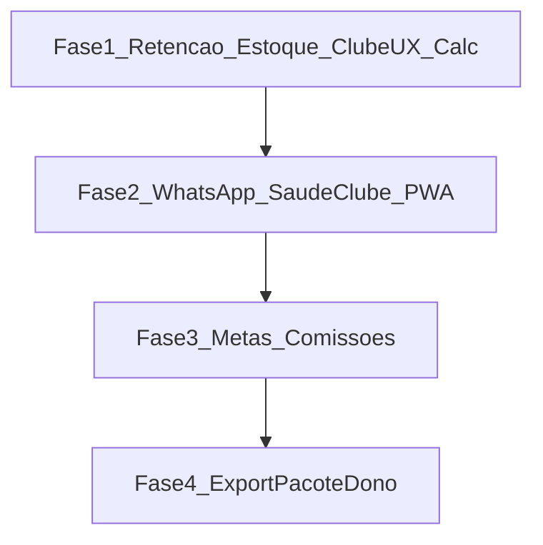

# Plano completo — paridade inteligente vs Cash Barber

## Antes: como funcionam as cores da frequência

As cores **não** mudam por “dia da semana” nem por filtro da UI. Elas dependem **somente do % da célula**.

### 1) Como o % é calculado (últimos 30 dias)

Para cada combinação **dia da semana + hora** (ex.: Seg 09h):

```
% = (cortes nesse slot) ÷ (quantas vezes aquele dia apareceu × nº de barbeiros) × 100
```

- Conta só agendamentos `CONFIRMED` / `COMPLETED`.
- Capacidade = ocorrências daquele weekday nos 30 dias × barbeiros (ou 1 se filtrar um profissional).
- Código: `src/lib/admin-appointment-frequency.ts` (`percent = count / denom`).

**Exemplo:** 4 segundas no período, 2 barbeiros → teto de Seg 09h = `4 × 2 = 8`. Com 2 cortes → `2/8 = 25%`.

### 2) Condição de cada cor (faixas fixas)

Em `bandClass` (`src/components/admin-appointment-frequency-heatmap.tsx`):

| Condição do % | Cor |
|---------------|-----|
| `percent <= 20` | Azul (0–20%) |
| `percent <= 40` | Verde (21–40%) |
| `percent <= 60` | Amarelo (41–60%) |
| `percent <= 80` | Laranja (61–80%) |
| senão (`> 80`) | Rosa/vermelho (81–100%) |

Ou seja: **sobe o % → cor mais “quente”**. No print com tudo ~4–21%, quase tudo azul e só um pouco verde é o comportamento esperado.

Os filtros “Todas / Todos” **só mudam quais agendamentos entram no cálculo**; as faixas de cor continuam iguais.

---

## Escopo do produto (tudo pedido)

Entrega em **4 fases**. Cada fase fecha valor sozinha; ordem = impacto comercial vs esforço.



---

## Fase 1 — Retenção acionável + estoque + UX clube + calculadora

### 1.1 Sucesso do cliente / “quem está sumindo” no CRM

- Estender `getAdminCrmSnapshot` / tipos com `risk`: `ok` | `at_risk` | `lost` (ex.: 30–45d sem visita = risco; 60d+ = sumindo).
- Em `admin-crm-panel.tsx`:
  - Filtro **Em risco / Sumindo**
  - Coluna/badge de risco
  - CTA **WhatsApp** com texto pré-preenchido (“Sentimos sua falta…”)
- Bloco no topo: “Ligar / WhatsApp hoje” (lista curta dos N mais críticos).
- Chip no `/admin/operacional` linkando para `/admin/clientes?risk=lost`.

### 1.2 Estoque de produtos (saldo, entrada/saída, alerta)

Já existe `Product.stockQty` e baixa na comanda. Falta gestão explícita:

- Campo `stockMin` (alerta) no schema + migração.
- Modelo `ProductStockMovement` (entrada/saída/ajuste + motivo + qty + createdAt).
- UI em `admin-products-manager.tsx`: saldo, mínimo, botões Entrada/Saída/Ajuste.
- API `POST /api/admin/products/[id]/stock`.
- Alerta no operacional + badge quando `stockQty <= stockMin`.

### 1.3 Assinante vs avulso (site + comanda)

- No agendar público: badge **“Clube — X visitas restantes”**.
- Na comanda: mesmo badge + plano.
- Enriquecer GET da comanda com snapshot da assinatura por `clientPhone`.

### 1.4 Calculadora de precificação do clube

- Em `/admin/clube`: “Sugerir preço” (ticket/custo × visitas/mês × margem %).
- Só sugere; dono aplica no preço do plano.

---

## Fase 2 — WhatsApp fácil + saúde do clube + PWA

### 2.1 Confirmação / lembrete WhatsApp “ligar e pronto”

- Checklist no `/admin/whatsapp`.
- Toggle **Confirmar ao agendar** + **Lembrete 24h**.
- Templates padrão (nome, data, link `/minha-reserva`).

### 2.2 Painel de saúde do clube

- Seção em `/admin/clube`: subuso / no limite / inadimplentes / risco de churn.
- Reusa `ClientSubscription` (`visitsUsed`, `visitsIncluded`, `status`, `currentPeriodEnd`).

### 2.3 PWA do painel

- `manifest` + service worker mínimo + “Instalar app” no admin.

---

## Fase 3 — Metas e comissão escalonada / produto

- Meta mensal por barbeiro + progresso.
- Comissão por produto e/ou faixas escalonadas.
- Card “upsell sugerido” na comanda.

---

## Fase 4 — Pacote dono (exportação mensal)

- “Baixar mês”: Excel/PDF com faturamento, ranking, top serviços, retenção, clube.
- Entrada em Relatórios/Evolução; reusa `/api/admin/export`.

---

## Docs e navegação

- Atualizar `docs/historico-de-mudancas.md` e `docs/modulos-e-arquivos.md` a cada fase.
- Novos itens de menu só quando a tela existir.

## Fora de escopo

- App nativo App Store / Play.
- Trocar Asaas por GalaxPay.
- Mentoria/cursos tipo Podium Pass.

---

## Todos

1. Fase 1: risco/sumindo no CRM + fila WhatsApp hoje
2. Fase 1: stockMin, movimentos, alertas e UI entrada/saída
3. Fase 1: badge clube + visitas restantes (site e comanda)
4. Fase 1: calculadora de preço do plano de clube
5. Fase 2: confirmação/lembrete WhatsApp + checklist setup
6. Fase 2: painel saúde do clube (frequência/risco)
7. Fase 2: PWA do painel admin
8. Fase 3: metas barbeiro + comissão produto/escalonada
9. Fase 4: pacote exportação mensal dono (Excel/PDF)
